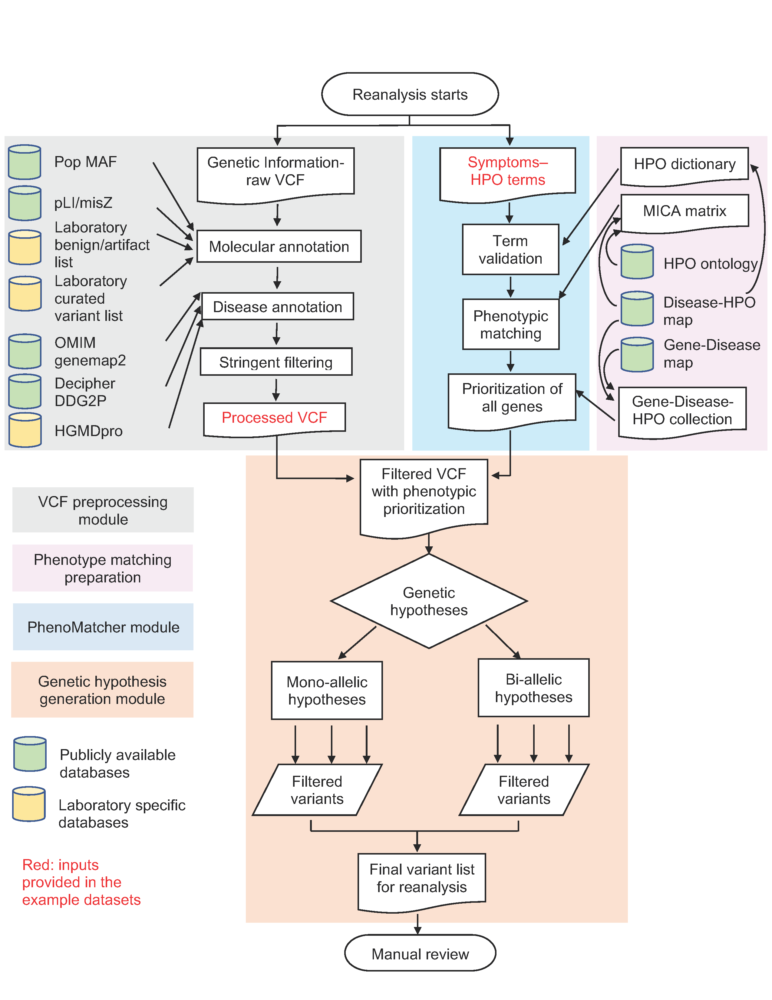
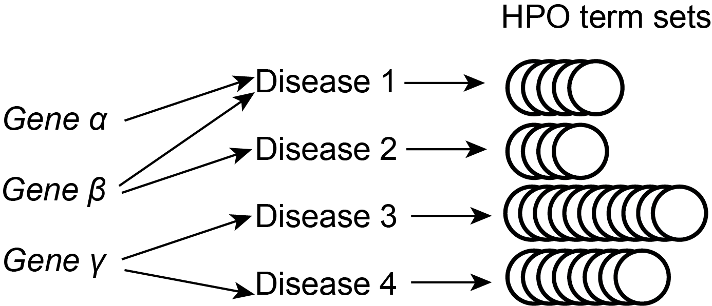

Semi-automated clinical exome reanalysis pipeline
================
Pengfei Liu, PhD FACMGG

-   [**Overview**](#overview)
-   [**Before you start**](#before-you-start)
-   [**VCF preprocessing module**](#vcf-preprocessing-module)
    -   [Pipeline for VCF preprocessing](#pipeline-for-vcf-preprocessing)
    -   [VCF molecular and disease annotation](#vcf-molecular-and-disease-annotation)
    -   [Stringent filtering of the VCF file](#stringent-filtering-of-the-vcf-file)
-   [**Phenotype matching preparation module**](#phenotype-matching-preparation-module)
    -   [Pipeline for phenotype matching preparation](#pipeline-for-phenotype-matching-preparation)
    -   [Generating the MICA matrix](#generating-the-mica-matrix)
    -   [Generate all Gene-Disease-HPO term set collections](#generate-all-gene-disease-hpo-term-set-collections)
    -   [Generating the HPO term dictionary.](#generating-the-hpo-term-dictionary.)
-   [**PhenoMatcher module**](#phenomatcher-module)
    -   [Pipeline of PhenoMatcher](#pipeline-of-phenomatcher)
    -   [Functions](#functions)
    -   [Running test data](#running-test-data)
-   [**Genetic hypothesis generation module**](#genetic-hypothesis-generation-module)
    -   [Pipeline of genetic hypothesis generation](#pipeline-of-genetic-hypothesis-generation)
    -   [Functions](#functions-1)
    -   [Running test data](#running-test-data-1)
-   [**Credits and Acknowledgements**](#credits-and-acknowledgements)

------------------------------------------------------------------------

**Overview**
============

This semi-automated reanalysis pipeline is designed for proband only clinical exome sequencing. The process consists of four modules:

-   **VCF preprocessing**
-   **Phenotype matching preparation**
-   **Phenotype matching for individual subjects (PhenoMatcher)**
-   **Genetic hypothesis generation and prioritization**

The input files are *raw VCF files* and *patient phenotypes in HPO terms*. The final output is a list of *filtered and reanalyzed variants* for manual review.

<center>


</center>
The pipeline utilizes several external databases as illustrated in the figure. The sources of these databases are summarized in the table below.

<table style="width:39%;">
<colgroup>
<col width="19%" />
<col width="19%" />
</colgroup>
<thead>
<tr class="header">
<th>Database</th>
<th>Resource link</th>
</tr>
</thead>
<tbody>
<tr class="odd">
<td>Population minor allele frequencies (MAF)</td>
<td><a href="http://www.openbioinformatics.org/annovar/" class="uri">http://www.openbioinformatics.org/annovar/</a> <br>(or multiple other alternative annotators)</td>
</tr>
<tr class="even">
<td>Functional gene constraint (pLI/misZ)</td>
<td><a href="ftp://ftp.broadinstitute.org/pub/ExAC_release/release0.3.1/functional_gene_constraint" class="uri">ftp://ftp.broadinstitute.org/pub/ExAC_release/release0.3.1/functional_gene_constraint</a></td>
</tr>
<tr class="odd">
<td>HGMDpro</td>
<td><a href="http://www.hgmd.cf.ac.uk/ac/index.php" class="uri">http://www.hgmd.cf.ac.uk/ac/index.php</a> <br>license required</td>
</tr>
<tr class="even">
<td>Laboratory benign/artifact list</td>
<td>maintained by the diagnostic laboratory; pipeline dependent</td>
</tr>
<tr class="odd">
<td>Laboratory curated variants</td>
<td>maintained by the diagnostic laboratory; locally sourced</td>
</tr>
<tr class="even">
<td>OMIM genemap2</td>
<td><a href="https://omim.org/downloads/" class="uri">https://omim.org/downloads/</a></td>
</tr>
<tr class="odd">
<td>Decipher DDG2P</td>
<td><a href="https://decipher.sanger.ac.uk/ddd#ddgenes" class="uri">https://decipher.sanger.ac.uk/ddd#ddgenes</a></td>
</tr>
<tr class="even">
<td>HPO ontology</td>
<td><a href="http://purl.obolibrary.org/obo/hp.obo" class="uri">http://purl.obolibrary.org/obo/hp.obo</a></td>
</tr>
<tr class="odd">
<td>Disease-HPO map</td>
<td><a href="https://hpo.jax.org/app/download/annotation" class="uri">https://hpo.jax.org/app/download/annotation</a></td>
</tr>
<tr class="even">
<td>Gene-Disease map</td>
<td><a href="https://hpo.jax.org/app/download/annotation" class="uri">https://hpo.jax.org/app/download/annotation</a> <br><a href="https://www.genenames.org/cgi-bin/download" class="uri">https://www.genenames.org/cgi-bin/download</a></td>
</tr>
</tbody>
</table>

This R markdown document provides step-by-step instructions for all four modules of the reanalysis pipeline. Code is provided to create the **Phenotype matching preparation**, **PhenoMatcher**, and **Genetic hypothesis generation** modules, but not for the **VCF preprocessing** module. The **VCF preprocessing** module utilizes the HGMD professional database as input, and this data requires a professional license; the benign/artifact and curated variant lists may also differ between different diagnostic laboratories or research groups because of differences in their variant calling pipeline and/or population sources of primary data. Nevertheless, the **VCF preprocessing** module is described in detail, and specifies a reproducible procedure that researchers or diagnostic laboratories routinely operate. With the appropriate parameters and following the instructions in this document, researchers and diagnosticians should be able to reproduce and customize this process with minimal difficulty. Detailed instructions and specifications are given below to help the readers understand and reproduce the VCF preprocessing step.

The test data provided in this documentation provides examples of preproceessed VCFs to be used as input data so that the downstream re-analysis process described in this study can be completed in entirety using the step-by-step code and instructions provided below.

**Before you start**
====================

The R code, database dependencies, and example test data are all deposited in the [GitHub page](https://github.com/liu-lab/exome_reanalysis). To run the code, download the files from GitHub with their original folder structure. Two files that are generated from the **Phenotype matching preparation** module, *~/exome\_reanalysis/data/output/pairs\_MICA.RData* and *~/exome\_reanalysis/data/output/MICA\_mat.RData* , are too large to be stored on GitHub. They can be either downloaded from this [link](https://bcm.box.com/v/exome-reanalysis) or created by the reader by running the code provided in this documentation.

The **Phenotype matching preparation** module is isolated from the other parts of the re-analysis pipeline, because the analyses therein are only dependent on disease mappings to the Human Phenotype Ontology (HPO) and to the HPO structure itself, rather than patient specific molecular or clinical information that are employed in the other renalysis modules. Thus, one can generate and save the results from this module and load them as required by downstream analyses. It is only necessary to run this block of code once to set up objects for the first time, or as desired to incorporate updates from OMIM and HPO on an ongoing basis for subsequent iterations of renalysis. One major output of this module is the Maximum Information Content of Ancestors (MICA) matrix, the generation of this large matrix requires longer compute time and more compute resources compared to other components in the subsequent modules of the re-analysis pipeline.

------------------------------------------------------------------------

**VCF preprocessing module**
============================

Pipeline for VCF preprocessing
------------------------------

The VCF preprocessing pipeline consists of two stages:

-   **VCF molecular and disease annotation**
-   **Stringent filtering of the VCF file**

The input is a raw VCF file. The output is an annotated filtered VCF file.

VCF molecular and disease annotation
------------------------------------

Raw VCF files are annotated with a minimum of the following information. A VCF header is given to illustrate the INFO fields.

    ##fileformat=VCFv4.0
    ##FORMAT=<ID=GT,Number=1,Type=String,Description="Genotype">
    ##FORMAT=<ID=GQ,Number=1,Type=Integer,Description="Genotype Quality">
    ##FORMAT=<ID=DP,Number=1,Type=Integer,Description="Read Depth">
    ##FORMAT=<ID=RR,Number=1,Type=Integer,Description="Reference Read Depth">
    ##FORMAT=<ID=VR,Number=1,Type=Integer,Description="Major Variant Read Depth">
    ##INFO=<ID=GN,Number=.,Type=String,Description="Gene name">
    ##INFO=<ID=GI,Number=.,Type=String,Description="HGVS nomenclature">
    ##INFO=<ID=DT,Number=.,Type=String,Description="Deleterious truncating variants">
    ##INFO=<ID=NS,Number=.,Type=String,Description="Novel or seen in the population">
    ##INFO=<ID=DS,Number=.,Type=String,Description="The gene is associated with a Mendelian disease based on information from OMIM and the literature">
    ##INFO=<ID=IHM,Number=.,Type=String,Description="Monoallelic inheritance mode of the disease gene">
    ##INFO=<ID=IHB,Number=.,Type=String,Description="Biallelic inheritance mode of the disease gene">
    ##INFO=<ID=EXAC_AC_HET,Number=1,Type=String,Description="ExAC heterozygous allele count">
    ##INFO=<ID=EXAC_AC_HMZ,Number=1,Type=String,Description="ExAC homozygous allele count">
    ##INFO=<ID=PLP,Number=.,Type=String,Description="Variants previously called as pathogenic or likely pathogenic internally">
    ##INFO=<ID=HGMD,Number=.,Type=String,Description="HGMD variant class is DM or DM?">
    ##INFO=<ID=HGMD_same_codon,Number=.,Type=String,Description="HGMD allelic variant class is DM or DM?">
    ##INFO=<ID=PLI,Number=1,Type=String,Description="pLI score obtained from the ExAC database version 20160113">
    ##INFO=<ID=MSZ,Number=1,Type=String,Description="missense variant Z score obtained from the ExAC database version 20160113">
    ##INFO=<ID=LMDDD,Number=.,Type=String,Description="Monoallelic loss-of-function disease mechanism based on DDD disease gene curation">

Instructions are given below regarding how to annotate the above INFO fields. The readers are also encouraged to open the three test data provided on [GitHub](https://github.com/liu-lab/exome_reanalysis) -- these are preprocessed annotated VCFs -- to understand the annotation and filtering results.

-   **GT**, **GQ**, **DP**, **RR**, **VR**, **GN**: the descriptions are self-explanatory.
-   **GI**: HGVS nomenclature of the variant. When multiple transcripts exist, they are separated by commas.
-   **DT**: truncating variants. The variant type is among one of the following: stop-gain, frameshift, canonical splice donor and acceptor (+-1,2), start-loss, and stop-loss.
-   **NS**: novel or seen in the following databases, ExAC, ESP, and 1000 genomes.
-   **DS**: Mendelian disease association from either OMIM or literature reports.
    -   Disease association from OMIM: in the genemap2.txt file downloaded from OMIM, the Phenotypes column contains a "(3)" disorder (i.e. the molecular basis of the disorder is known) that is not modified by "\[\]" or "{}".
    -   Disease association from the literature: from the resources provided by HGMD (licensed for commercial use), the gene contains at least one variant labeled as DM or DM?.
-   **IHM**, **IHB**: monoallelic or biallelic inheritance modes associated with a gene. The inheritance modes are summarized from a combination of information from the OMIM genemap2.txt file and the Decipher DDG2P.csv file. The presence of any of the following entry qualifies the gene to be of the corresponding inheritance mode.
    -   *OMIM*
        -   Monoallelic: Autosomal dominant; X-linked dominant; Somatic mutation; Somatic mosaicism; X-linked; Y-linked; Mitochondrial
        -   Biallelic: Autosomal recessive; Digenic recessive; X-linked recessive; X-linked
    -   *Decipher*
        -   Monoallelic: monoallelic; hemizygous; biallelic,monoallelic; mosaic; hemizygous; x-linked dominant; imprinted; x-linked dominant; x-linked over-dominance; monoallelic,mosaic; imprinted,monoallelic,mosaic; hemizygous,monoallelic; mitochondrial
        -   Biallelic: biallelic; biallelic,monoallelic; digenic; biallelic,digenic
-   **EXAC\_AC\_HET**, **EXAC\_AC\_HMZ**, **PLP**, **HGMD**, **HGMD\_same\_codon**, **PLI**, **MSZ**: the descriptions are self-explanatory. The HGMD content is licensed.
-   **LMDDD**: the allelic requirements and mutation consequence of the gene from the Decipher DDG2P.csv file satisfy both of the following requirements.
    -   allelic requirements: monoallelic; hemizygous; biallelic,monoallelic; mosaic; hemizygous; x-linked dominant; imprinted; x-linked dominant; x-linked over-dominance; monoallelic,mosaic; imprinted,monoallelic,mosaic; hemizygous,monoallelic; mitochondrial
    -   mutation consequence: loss of function

Stringent filtering of the VCF file
-----------------------------------

The following filtering parameters are applied to filter the annotate VCF as part of the initialization of the re-analysis procedure.

-   All variants from the laboratory-maintained pathogenic and likely pathogenic lists are retained.
-   All variants from the laboratory-maintained artifact and benign/likely benign lists are excluded.
-   Variants not curated by the laboratory to be pathogenic or likely pathogenic that are observed in the ExAC database with one or more homozygous/hemizygous count are excluded.
-   Variants from the laboratory-maintained uncertain significance list that are novel in the population and observed in the laboratory patient database 5 or more times are excluded.
-   Variants from the laboratory maintained uncertain significance list that are seen in the population and observed in the laboratory patient database 3 or more times are excluded.
-   Only variants located in genes with a Mendelian disease association are retained. (**DS** from the VCF INFO field as *TRUE*)

------------------------------------------------------------------------

**Phenotype matching preparation module**
=========================================

Pipeline for phenotype matching preparation
-------------------------------------------

The Phenotype matching preparation pipeline comprises three separate components:

-   **Generating the MICA matrix**
-   **Generate all Gene-Disease-HPO term set collections**
-   **Generating the HPO term dictionary**

The input data are HPO ontology, Disease-HPO mapping, and Gene-Disease mapping files. The output data are MICA matrix, Gene-Disease-HPO collections, and the HPO dictionary, which are all intermediate analysis results that will be called or employed by downstream functions in the reanalysis process. These results are enabling tools for the phenotypic match analysis employed in the subsequent modules. Again, this module needs to be executed only once to set up objects or as desired to renew the phenotypic match information as new releases of HPO and/or disease-to-HPO mappings become available.

Generating the MICA matrix
--------------------------

The MICA (Most Informative Common Ancestor) matrix provides the foundation to compute Resnik similarity between the patient's phenotype and specific diseases as defined by distinct HPO term sets. Figure 2 below illustrates a schematic process of building the MICA matrix.

-   Build a Disease-HPO matrix to inform calculation of Information Content (IC) of each HPO term
-   Calculate IC
-   Calculate the MICA for each pair of HPO terms
-   Generate a matrix of MICA values for downstream calculations

<center>


</center>
The code for the above-mentioned process are specified below.

1.  Get HPO terms and the ancestors for each HPO term.

``` r
hpo = get_ontology('data/input/hp.obo',extract_tags = 'everything') 

id_to_term = data_frame(id = hpo$id,
                        term = hpo$name)
save(id_to_term, file = 'data/output/hpo_id_to_term.RData')

hpo_ancestry = hpo$ancestors %>%
  data_frame(ID = names(.),
             ancestors = .)
save(hpo_ancestry, file = 'data/output/hpo_ancestry.RData')
```

1.  Get the association / mapping between disease and HPO terms. Each disease is represented by a set of HPO terms that indicates the presence of that phenotype for the given disease.

``` r
disease_to_hpo = read_tsv('data/input/phenotype_annotation_hpoteam.tab',
                      col_names = c('db',
                                    'db_object_id',
                                    'db_name',
                                    'qualifier',
                                    'hpo_id',
                                    'db_reference',
                                    'evidence_code',
                                    'onset_modifier',
                                    'frequency_modifier',
                                    'with',
                                    'aspect',
                                    'synonym',
                                    'date',
                                    'assigned_by',
                                    'frequency_description'))
```

1.  Calculate the IC for each HPO term. To find the IC of a term, we arrange the disease-to-phenotype data into an n x m binary matrix, where rows are n diseases and columns are all m HPO terms including ancestral terms. A given cell contains the value 1 if a disease is annotated to a branch of the phenotype ontology containing the term, and otherwise we set values to 0. We then calculate the IC of each term (each column of the matrix) using IC(m)= -log(f(m)), where m is an HPO term and the value f(m) is the frequency of the HPO term across all diseases. For a binary matrix, the frequency of a column is given by the average of the column, which is the proportion of rows with the value of 1. Note that the more rare a phenoytpe term is across diseases, the higher the IC of the term. This makes intuitive sense because rare characteristics contain more diagnostic specificity than common characteristics shared by many diseases.

``` r
disease_term_mat = disease_to_hpo %>%
  select(db_name, hpo_id) %>%
  unique %>%
  left_join(hpo_ancestry, by = c('hpo_id' = 'ID')) %>%
  select(-hpo_id) %>%
  unnest %>%
  mutate(value = 1) %>%
  unique %>%
  spread(ancestors, value, fill = 0)%>%
  dplyr::select(-db_name) %>%
  as.matrix

IC_vec = -log(colMeans(disease_term_mat))
save(IC_vec, file = 'data/output/IC_vec.RData')
```

1.  Calculate the MICA (an m x m matrix) entry for each pair of HPO terms. Two major functions are required: *get\_ancestor\_overlap* acquires all the common ancestors for a pair of HPO terms. *get\_max\_ic* calculates MICA using the maximum value of IC vector from the previous step for all candidate common ancestors between a term pair. In the matrix, two special conditions may occur. First, the two terms being compared may be identical, i.e., their relation element appears on the diagnoal line of the matrix. In this case, the *get\_max\_ic* function returns the IC of the term itself. Second, if the the term is not in the disease database and thus not in the IC vector, the *get\_max\_ic* function calls another function called *get\_max\_unannotated\_ic*, which returns the maximum IC of any of its ancestors.

``` r
get_ancestor_overlap = function(id_1, id_2){

  anc_list = hpo_ancestry %>% 
    filter(ID %in% c(id_1, id_2)) %>% 
    .$ancestors
  
  intersect(anc_list[[1]], anc_list[[2]])
  
}

get_max_unannotated_ic = function(unannotated_term){

  term_ancestors = hpo_ancestry %>% 
    filter(ID == unannotated_term) %>% 
    pull(ancestors) %>% 
    .[[1]]
  
  max(IC_vec[term_ancestors], na.rm = TRUE)
}

get_max_ic = function(id_1, id_2) {
  
    if (id_1 == id_2) {
    if (id_1 %in% names(IC_vec)) {
      return(IC_vec[id_1]) 
    } else {
      return(get_max_unannotated_ic(id_1))
    }
    
  }
  
  overlapping_terms = get_ancestor_overlap(id_1, id_2)
  
  if (length(overlapping_terms) == 0) return(0)
  max(IC_vec[names(IC_vec) %in% overlapping_terms])
}

try_get_max_ic = function(id_1, id_2) {
  try(get_max_ic(id_1, id_2))
}
```

1.  Complete the generation of the MICA matrix. To accomplish this, generate a matrix with all pairs of HPO terms and then calculate the MICA for all pairs. Save this result to disk for future use.

``` r
ancestor_pairs = combn(hpo_ancestry$ID,2) %>%
  t %>%
  as_tibble

pairs_MICA = ancestor_pairs %>%
  mutate(max_shared_ancestor_IC = mcmapply(try_get_max_ic, 
                                           V1, V2, 
                                           mc.cores = 20, 
                                           SIMPLIFY = TRUE))

diag_pairs = data_frame(V1 = hpo$id,
                        V2 = hpo$id) %>% 
  mutate(max_shared_ancestor_IC = mcmapply(try_get_max_ic, 
                                           V1, V2, 
                                           mc.cores = 20, 
                                           SIMPLIFY = TRUE))

pairs_MICA = pairs_MICA %>%
  bind_rows(diag_pairs)

save(pairs_MICA, file = 'data/output/pairs_MICA.RData')

MICA_mat = pairs_MICA %>%
  spread(V2, value = max_shared_ancestor_IC, fill = NA) %>%
  as.data.frame()

rownames(MICA_mat) = MICA_mat$V1
MICA_mat$V1 = NULL
MICA_mat %<>% as.matrix
MICA_mat[lower.tri(MICA_mat)] = t(MICA_mat)[lower.tri(MICA_mat)]

save(MICA_mat,
     file = 'data/output/MICA_mat.RData')
```

Generate all Gene-Disease-HPO term set collections
--------------------------------------------------

The goal of this segment is to enumerate HPO term sets for all possible gene-disease combinations, as illustrated in Figure 3 below.

The input is the Gene-Disease map and the Disease-HPO map. The output is an enumeration of all possible relations between Gene-Disease-HPO terms. This output file will be used in the **PhenoMatcher module** to compute prioritization scores for all genes based on their Resnik similarity score with the patient's phenotype.

<center>


</center>
The code for the above mentioned process are specified below.

1.  Load input data. The Disease-HPO map has already been loaded from the MICA matrix generation procedures. The Gene-Disease map is loaded here. The gene information from the Gene-Disease map is encoded with entrez gene ID. Therefore, a gene symbol-entrez gene id table is used to translate the gene id to gene symbol. Both tables can be downloaded from the HPO website with the download link provided in Table 1.

``` r
genes_to_diseases = read_tsv('data/input/genes_to_diseases.txt',
                            skip = 1,
                             col_names = c('entrez_gene_id', 'entrez_gene_symbol', 'disease_id'))

entrez_to_hgnc = read_tsv('data/input/entrez_to_hgnc.tsv') %>% 
  select(`Approved Symbol`, `Entrez Gene ID`)   

names(entrez_to_hgnc) = names(entrez_to_hgnc) %>% map_chr(~gsub(' ', '_', .x))
```

1.  Merge the Gene-Disease table with the Disease-HPO table.

``` r
dz_gene_db_ref_hpo <- merge(genes_to_diseases, disease_to_hpo, by.x = "disease_id", by.y = "db_reference")
dz_gene_db_ref_hpo2 <- unique(dz_gene_db_ref_hpo[,c(1:3,6,8)]) %>%
group_by(disease_id, entrez_gene_id, entrez_gene_symbol,db_name) %>% 
summarise(hpo_id = list(unique(hpo_id)))

dz_gene_db_ref_hpo<- dz_gene_db_ref_hpo2
save(dz_gene_db_ref_hpo, file = "data/output/dz_gene_db_ref_hpo.RData")
```

Generating the HPO term dictionary.
-----------------------------------

The HPO term dictionary will be used in the **PhenoMatcher module** for input term validation.

The input is the Disease-HPO map. The output is an enumeration of all terms appearing in the Disease-HPO map.

``` r
all_hpo_term <- unique(unlist(disease_to_hpo$hpo_id))
save(all_hpo_term, file="data/output/all_hpo_term.RData")
```

------------------------------------------------------------------------

**PhenoMatcher module**
=======================

Pipeline of PhenoMatcher
------------------------

The PhenoMatcher pipeline operates on primary data for individual subjects to produce gene-level phenotypic match scores, and it assumes that the MICA and other objects from the phenotypic match preparation module are available. The PhenoMatcher consists of two stages:

-   **Load phenotype data of the individual subject**
-   **Generate semantic matching score for all disease genes in relation to the subject's phenotypes.**

``` r
LoadPhenotypeData("PATH_TO_PHENOTYPE_INPUT_FILE") %>% GeneratePenotypeScores(.)
```

Functions
---------

1.  **Function to load phenotype data**. The data input format should be patient ID and HPO numbers separated by a tab. The HPO numbers are delimitated by semicolons. In the example below, 100001 is the patient ID. The patient HPOs are HP:0001290;HP:0001250;HP:0000253;HP:0001298;HP:0002126.

> 100001 HP:0001290;HP:0001250;HP:0000253;HP:0001298;HP:0002126

``` r
LoadPhenotypeData = function(Patient_HPO_path)
{
  ptdata <- read_tsv(Patient_HPO_path,col_names = F)
  ptHPOinput <- strsplit(ptdata[[2]],";")[[1]]
  ptID <- ptdata[[1]]
  HPO_valid <- intersect(ptHPOinput, all_hpo_term)
  list(HPO_valid, ptID)
}
```

1.  **Function to compute the Resnik similarity scores given a set of terms annotated to a patient and a set associated with a disease.** The rationale of this function is illustrated in Figure 4 below.

``` r
compare_term_sets = function(annotated_set, disease_set)
{
  if (length(disease_set) == 0) {return(0)}
  
  sub_mica_1 = MICA_mat[annotated_set, disease_set, drop = FALSE]
  resnik_1 = mean(apply(sub_mica_1, 1, max))
  
  sub_mica_2 = MICA_mat[disease_set, annotated_set, drop = FALSE]
  resnik_2 = mean(apply(sub_mica_2, 1, max))
  
  round(mean(c(resnik_1, resnik_2)),digits = 3)
}
```

<center>


</center>
1.  **Generate semantic matching score for all disease genes in relation to the patient's phenotypes.** In this function, the patient HPO terms are compared with disease HPO terms with the *compare\_term\_sets* function. The comparison is done for all OMIM gene-diseases as enumerated in the dataframe *dz\_gene\_db\_ref\_hpo*. The output of the function is a .csv file written to the disk with sample ID in the file name. The patient ID and HPO terms are also written into the .csv file content. Each row represents matching of a disease gene to the patient's HPO term sets. Each time an output file is generated, it contains the same number of rows. The rows are sorted by the *PhenoMatch\_score\_max* in descending order.

``` r
GeneratePenotypeScores = function(Pt_processed_HPO_data)
{
  Pt_HPO_processed <- Pt_processed_HPO_data[1]
  Pt_ID <- Pt_processed_HPO_data[2]
  PtHPO_DzHPO_compare <- dz_gene_db_ref_hpo %>%
                        rowwise() %>%
                          mutate(
                                  Pt_HPO_valid= Pt_HPO_processed,
                                  PhenoMatch_score = compare_term_sets(hpo_id,Pt_HPO_valid )) %>%
                          select(-hpo_id, -Pt_HPO_valid) %>%
                          group_by(entrez_gene_symbol) %>%
                          arrange(desc(PhenoMatch_score)) %>%
                          mutate(disease_id_max = dplyr::first(disease_id),
                                 PhenoMatch_score_max = dplyr::first(PhenoMatch_score),
                                disease_name_max = dplyr::first(db_name)) %>%
                           group_by( entrez_gene_symbol, disease_id_max, PhenoMatch_score_max ) %>%
                           dplyr::summarise(
                                  dz_ID_all = paste(disease_id, collapse  = ";"),
                                  scores = paste(PhenoMatch_score, collapse  = ";"))  %>%
                          arrange(desc(PhenoMatch_score_max)) %>% 
                           mutate(ID = unlist(Pt_ID),
                                  Patient_HPO = paste(unlist(Pt_HPO_processed), collapse = ";") )

      write.csv(PtHPO_DzHPO_compare, 
                file=paste0('data/test_data/output/',Pt_ID, '_PhenoMatcher_output.csv'), row.names = FALSE)

}
```

Alternatively, the HPO data can be entered into the [PhenoMatcher website](http://genomicanalysis.research.bcm.edu:3838/PhenoMatcher/) to generate the same results. The output phenotype matching file is in the same format of the file generated from the PhenoMatcher website.

Running test data
-----------------

``` r
LoadPhenotypeData("data/test_data/input/Phenotype_100001.txt") %>% GeneratePenotypeScores(.)
LoadPhenotypeData("data/test_data/input/Phenotype_100002.txt") %>% GeneratePenotypeScores(.)
LoadPhenotypeData("data/test_data/input/Phenotype_100003.txt") %>% GeneratePenotypeScores(.)
```

The outputs are written to the disk as .csv files. They look like this

    ## # A tibble: 6 x 7
    ##   entrez_gene_sym… disease_id_max PhenoMatch_scor… dz_ID_all scores     ID
    ##   <chr>            <chr>                     <dbl> <chr>     <chr>   <int>
    ## 1 PNKP             OMIM:613402                2.66 OMIM:613… 2.661… 100001
    ## 2 CCDC88A          OMIM:260565                2.44 OMIM:260… 2.439  100001
    ## 3 ZNHIT3           OMIM:260565                2.44 OMIM:260… 2.439  100001
    ## 4 SLC25A22         OMIM:609304                2.36 OMIM:609… 2.358  100001
    ## 5 MECP2            OMIM:300673                2.35 OMIM:300… 2.345… 100001
    ## 6 SPTAN1           OMIM:613477                2.28 OMIM:613… 2.278  100001
    ## # ... with 1 more variable: Patient_HPO <chr>

    ## # A tibble: 6 x 7
    ##   entrez_gene_sym… disease_id_max PhenoMatch_scor… dz_ID_all scores     ID
    ##   <chr>            <chr>                     <dbl> <chr>     <chr>   <int>
    ## 1 SPATA5           OMIM:616577                1.87 OMIM:616… 1.867  100002
    ## 2 POGZ             OMIM:616364                1.82 OMIM:616… 1.822  100002
    ## 3 SON              OMIM:617140                1.80 OMIM:617… 1.803  100002
    ## 4 BCOR             OMIM:309800                1.79 OMIM:309… 1.793… 100002
    ## 5 NAA10            OMIM:309800                1.79 OMIM:309… 1.793… 100002
    ## 6 AP3B1            OMIM:608233                1.79 OMIM:608… 1.792  100002
    ## # ... with 1 more variable: Patient_HPO <chr>

    ## # A tibble: 6 x 7
    ##   entrez_gene_sym… disease_id_max PhenoMatch_scor… dz_ID_all scores     ID
    ##   <chr>            <chr>                     <dbl> <chr>     <chr>   <int>
    ## 1 SLC9A3           OMIM:616868                3.36 OMIM:616… 3.357  100003
    ## 2 EPCAM            OMIM:613244                2.64 OMIM:613… 2.635… 100003
    ## 3 HNRNPH2          OMIM:300986                2.43 OMIM:300… 2.428  100003
    ## 4 BCL10            OMIM:137245                2.40 OMIM:137… 2.396… 100003
    ## 5 CFC1             OMIM:613853                2.40 OMIM:613… 2.396… 100003
    ## 6 PPM1D            OMIM:617450                2.25 OMIM:617… 2.251… 100003
    ## # ... with 1 more variable: Patient_HPO <chr>

------------------------------------------------------------------------

**Genetic hypothesis generation module**
========================================

Pipeline of genetic hypothesis generation
-----------------------------------------

The genetic hypothesis generation pipeline consists of three stages:

-   **Load and transform a VCF file into a data table format**
-   **Load phenotype matching data and integrate this content with the table**
-   **Compute monoallelic and biallelic hypothesis and prioritize variants**

``` r
MakeTableFromVCF("PATH_TO_FILTERED_VCF") %>%
  MergePhenotype("PATH_TO_MERGED_PHENOTYPE_FILE") %>%
  Compute_Hypothesis(Parental_sample_availability=FALSE)
```

Functions
---------

1.  **Function to load and transform a VCF file into a table.** The input is the annotated filtered VCF file, which is the output of the **VCF preprocessing** module. This VCF file is loaded with the *readVcf* function from the *VariantAnnotation* R package. After loading the VCF file, the function transforms the VCF file into a table. It also writes the patient ID into the table file.

``` r
MakeTableFromVCF = function(vcf_path)
{
  vcf_file <- readVcf(vcf_path)
  vcf_table <- as.tibble(data.frame(rowRanges(expand(vcf_file)), geno(vcf_file)$GT, 
                                  geno(vcf_file)$VR, geno(vcf_file)$DP,info(expand(vcf_file)), stringsAsFactors = F))

  vcf_table$GI  <- sapply(vcf_table$GI, function(x) {paste(x,collapse = ",")})
  vcf_table <- vcf_table %>% mutate_at(.vars = vars(GN,DT,NS,DS,IHM,IHB,PLP,HGMD,HGMD_same_codon,LMDDD), 
                                     .funs = unlist)
  vcf_table <- vcf_table %>% mutate_at(.vars = vars(EXAC_AC_HET,EXAC_AC_HMZ), .funs = as.integer)
  vcf_table <- vcf_table %>% mutate_at(.vars = vars(PLI,MSZ), .funs = as.numeric)

  PtVrnt_anno <- vcf_table %>% dplyr::select(-c(end,width,strand,paramRangeID))
  colnames(PtVrnt_anno) <- c("CHROM","POS","REF","ALT","QUAL","FILTER","Zygosity","Variant_read","Total_read",
                           "Gene_name","Gene_information","Deleterious","Novel_seen","Disease",
                           "Monoallelic_inheritance", "Biallelic_inheritance",
                           "EXAC_AC_HET","EXAC_AC_HMZ","Previous_pathogenic","HGMD","HGMD_same_codon",
                           "pLI","Mis_Z","Monoallelic_LoF_DDD")
  
  PtVrnt_anno <-  PtVrnt_anno %>% 
                    mutate(PtID= samples(header(vcf_file))) 
  PtVrnt_anno
}
```

1.  **Function to load phenotype matching data.** This function can load either outputs generated from the PhenoMatcher script module or outputs generated from the PhenoMatcher website.

``` r
MergePhenotype = function(Variant_table, Phenotype_file_path)
{
  PtHPO_DzHPO_compare <- read_csv(Phenotype_file_path)

  Variant_table_phenotype_merged <- Variant_table %>% 
            left_join(PtHPO_DzHPO_compare, by=c('Gene_name' = 'entrez_gene_symbol'))  
  Variant_table_phenotype_merged
}
```

1.  **Function to compute monoallelic and biallelic hypothesis and prioritize variants.** One of the function inputs *Parental\_sample\_availability* asks for a *TRUE* or *FALSE* logical vector. This logical vector informs prioritization rules, as is explained below. This function consists of two parts, the **monoallelic genetic hypothesis** and the **biallelic genetic hypothesis**. The definitions of *monoallelic* or *biallelic* inheritance modes are explained above in the **VCF molecular and disease annotation** section.
    -   The **Monoallelic hypothesis** filters for variants that are
        -   located in genes with known monoallelic disease inheritance, and
        -   rare in the ExAC database (&lt;=5 heterozygous counts), or not rare in ExAC (&gt;5 heterozygous counts) but previously classified as pathogenic or likely pathogenic in our internal database, and
        -   fulfilling one of the four following rules
            -   previously reported as pathogenic or likely pathogenic internally
            -   truncating variants with likely haploinsufficiency disease mechanism (defined as a stringent pLI cutoff of &gt;0.99 or classified as loss-of-function disease mechanism by the DDD group)
            -   variants that are not seen in the control database but seen in patients from the literature (or allelic variants seen in patients)
            -   variants that are not seen in either control databases or in patients; however, the gene is associated with likely haploinsufficiency disease mechanism (same as mentioned above) or predicted to be intolerant to missense variations (missense intolerant Z score from the ExAC database &gt; 3). To limit the number of variants included from this subgroup, the phenotype matching score has to be higher than a certain cutoff (set as 0.3 in this study); genes without HPO annotation and therefore no phenotype matching score are not excluded. This subgroup of variants, based on the ACMG/AMP variant classification guideline, likely needs extra evidence to be classified as pathogenic or likely pathogenic. The extra piece of evidence usually is that the variant is found to be of de novo origin after parental studies, which requires availability of parental samples for proband only exome analysis. Therefore, an additional logic is added here: this subset of variants will only be retained if both parental samples are available for subsequent targeted variant study.
    -   The **Biallelic hypothesis** filters for variants that are located in genes with known biallelic disease inheritance, and exclude variants that are located in genes with low phenotype matching scores. It then filters variants that are
        -   previously classified as pathogenic or likely pathogenic internally
        -   truncating variants
        -   rare in the ExAC database
        -   potentially biallelic. The current pipeline is designed for proband only exome sequencing. So, a "potential biallelic" status is defined as more than one variant appearing in the same gene or variants being hemizygous or homozygous.

``` r
Compute_Hypothesis = function(Variant_table_phenotype_merged, Parental_sample_availability)
{
  vrnt_df_mono_filt <- Variant_table_phenotype_merged %>% 
    filter( Monoallelic_inheritance==TRUE & 
            (EXAC_AC_HET<=5 | Previous_pathogenic==TRUE) &
               (Previous_pathogenic==TRUE |
                  (Deleterious=="deleterious" & (pLI > 0.99 | Monoallelic_LoF_DDD==TRUE) ) |
                  (Novel_seen=="novel" & (HGMD==TRUE | HGMD_same_codon==TRUE)) | 
                  (Novel_seen=="novel" & 
                    ((pLI > 0.99 | Monoallelic_LoF_DDD==TRUE) | Mis_Z > 3) & 
                    (PhenoMatch_score_max>0.3 | is.na(PhenoMatch_score_max) ) & Parental_sample_availability)) )  

  vrnt_df_bi_filt <- Variant_table_phenotype_merged %>% 
                          filter(Biallelic_inheritance==TRUE & 
                                   (PhenoMatch_score_max>0.3 | is.na(PhenoMatch_score_max) ) & 
                                   ( Previous_pathogenic==TRUE |  Deleterious=="deleterious" | EXAC_AC_HET<=5) )  %>% 
                            group_by(Gene_name) %>% filter( n()>1 | Zygosity=="1/1") %>% ungroup


  Variants_prioritized <- bind_rows(vrnt_df_mono_filt, vrnt_df_bi_filt) %>%
                              distinct(PtID, CHROM, POS, REF, ALT, .keep_all = TRUE)

  Variants_prioritized
}
```

Running test data
-----------------

``` r
MakeTableFromVCF("data/test_data/input/100001.vcf") %>%
  MergePhenotype("data/test_data/output/100001_PhenoMatcher_output.csv") %>%
  Compute_Hypothesis(Parental_sample_availability=FALSE)
```

    ## # A tibble: 7 x 31
    ##   CHROM    POS REF   ALT   Zygosity Gene_name Gene_information Deleterious
    ##   <fct>  <int> <chr> <chr> <chr>    <chr>     <chr>            <chr>      
    ## 1 11    6.82e7 A     G     0/1      LRP5      LRP5:NM_002335:… deleterious
    ## 2 12    3.30e7 G     A     0/1      PKP2      PKP2:NM_004572:… .          
    ## 3 X     1.53e8 G     A     0/1      MECP2     MECP2:NM_004992… deleterious
    ## 4 11    6.82e7 G     A     0/1      LRP5      LRP5:NM_002335:… .          
    ## 5 2     1.80e8 G     A     0/1      TTN       TTN:NM_133378:e… .          
    ## 6 2     1.80e8 C     A     0/1      TTN       TTN:NM_133378:e… .          
    ## 7 X     6.34e7 C     T     1/1      AMER1     AMER1:NM_152424… .          
    ## # ... with 23 more variables: Novel_seen <chr>, QUAL <dbl>, FILTER <chr>,
    ## #   Variant_read <int>, Total_read <int>, Disease <chr>,
    ## #   Monoallelic_inheritance <chr>, Biallelic_inheritance <chr>,
    ## #   EXAC_AC_HET <int>, EXAC_AC_HMZ <int>, Previous_pathogenic <chr>,
    ## #   HGMD <chr>, HGMD_same_codon <chr>, pLI <dbl>, Mis_Z <dbl>,
    ## #   Monoallelic_LoF_DDD <chr>, PtID <chr>, disease_id_max <chr>,
    ## #   PhenoMatch_score_max <dbl>, dz_ID_all <chr>, scores <chr>, ID <int>,
    ## #   Patient_HPO <chr>

``` r
MakeTableFromVCF("data/test_data/input/100002.vcf") %>%
  MergePhenotype("data/test_data/output/100002_PhenoMatcher_output.csv") %>%
  Compute_Hypothesis(Parental_sample_availability=TRUE)  
```

    ## # A tibble: 10 x 31
    ##    CHROM    POS REF   ALT   Zygosity Gene_name Gene_information Deleterious
    ##    <fct>  <int> <chr> <chr> <chr>    <chr>     <chr>            <chr>      
    ##  1 1     1.69e7 A     T     0/1      NBPF1     NBPF1,NBPF1:uc0… VUS        
    ##  2 1     1.83e8 C     G     0/1      LAMC1     LAMC1:NM_002293… .          
    ##  3 1     2.29e8 C     T     0/1      TRIM11    TRIM11,TRIM11:u… .          
    ##  4 14    3.16e7 C     G     0/1      HECTD1    HECTD1:NM_01538… .          
    ##  5 16    8.93e7 CG    C     1/0      ANKRD11   ANKRD11:NM_0132… deleterious
    ##  6 18    2.86e7 T     TTC   1/0      DSC2      DSC2:NM_024422:… deleterious
    ##  7 19    1.78e7 T     TGG   1/0      UNC13A    UNC13A,UNC13A:u… .          
    ##  8 7     1.01e8 C     T     0/1      VGF       VGF:NM_003378:e… .          
    ##  9 X     2.22e7 A     C     0/1      PHEX      PHEX:NM_000444:… .          
    ## 10 X     4.49e7 T     C     0/1      KDM6A     KDM6A:NM_021140… .          
    ## # ... with 23 more variables: Novel_seen <chr>, QUAL <dbl>, FILTER <chr>,
    ## #   Variant_read <int>, Total_read <int>, Disease <chr>,
    ## #   Monoallelic_inheritance <chr>, Biallelic_inheritance <chr>,
    ## #   EXAC_AC_HET <int>, EXAC_AC_HMZ <int>, Previous_pathogenic <chr>,
    ## #   HGMD <chr>, HGMD_same_codon <chr>, pLI <dbl>, Mis_Z <dbl>,
    ## #   Monoallelic_LoF_DDD <chr>, PtID <chr>, disease_id_max <chr>,
    ## #   PhenoMatch_score_max <dbl>, dz_ID_all <chr>, scores <chr>, ID <int>,
    ## #   Patient_HPO <chr>

``` r
MakeTableFromVCF("data/test_data/input/100003.vcf") %>%
  MergePhenotype("data/test_data/output/100003_PhenoMatcher_output.csv") %>%
  Compute_Hypothesis(Parental_sample_availability=FALSE)
```

    ## # A tibble: 6 x 31
    ##   CHROM    POS REF   ALT   Zygosity Gene_name Gene_information Deleterious
    ##   <fct>  <int> <chr> <chr> <chr>    <chr>     <chr>            <chr>      
    ## 1 1     1.52e8 CACTG C     1/0      FLG       FLG:NM_002016:e… deleterious
    ## 2 1     2.42e8 A     ATTT  1/0      FH        FH:NM_000143:ex… .          
    ## 3 15    4.87e7 G     A     0/1      FBN1      FBN1:NM_000138:… .          
    ## 4 20    5.79e7 G     GA    1/0      EDN3      EDN3:NM_207034:… deleterious
    ## 5 2     1.98e8 CA    C     1/0      PGAP1     PGAP1:NM_024989… deleterious
    ## 6 2     1.98e8 C     G     0/1      PGAP1     PGAP1:NM_024989… deleterious
    ## # ... with 23 more variables: Novel_seen <chr>, QUAL <dbl>, FILTER <chr>,
    ## #   Variant_read <int>, Total_read <int>, Disease <chr>,
    ## #   Monoallelic_inheritance <chr>, Biallelic_inheritance <chr>,
    ## #   EXAC_AC_HET <int>, EXAC_AC_HMZ <int>, Previous_pathogenic <chr>,
    ## #   HGMD <chr>, HGMD_same_codon <chr>, pLI <dbl>, Mis_Z <dbl>,
    ## #   Monoallelic_LoF_DDD <chr>, PtID <chr>, disease_id_max <chr>,
    ## #   PhenoMatch_score_max <dbl>, dz_ID_all <chr>, scores <chr>, ID <int>,
    ## #   Patient_HPO <chr>

**Credits and Acknowledgements**
================================

The semantic phenotype matching code is developed by graduate student Andrew Ghazi <Andrew.Ghazi@bcm.edu> and his thesis supervisor Dr. Chad Shaw <cashaw@bcm.edu>; Mr. Ghazi is a student in Dr. Shaw’s laboratory, and the phenotype matching code for this work is a re-implementation and extension of the algorithm from the previous publication developed in Dr. Shaw’s laboratory at BCM [James et al. A visual and curatorial approach to clinical variant prioritization and disease gene discovery in genome-wide diagnostics.(2016) Genome Med. 8:13.](https://genomemedicine.biomedcentral.com/articles/10.1186/s13073-016-0261-8).

The Shiny webtool [PhenoMatcher](http://genomicanalysis.research.bcm.edu:3838/PhenoMatcher/) is developed by Xiaofei Song <xiaofei.song@bcm.edu>.

The semi-automated reanalysis pipeline is developed by Dr. Pengfei Liu <pengfei.liu@bcm.edu> and Xiaofei Song. We acknowledge the support provided by Mr. Paul Vandeventer.

For questions about this package, please contact Dr. Pengfei Liu <pengfei.liu@bcm.edu>.
